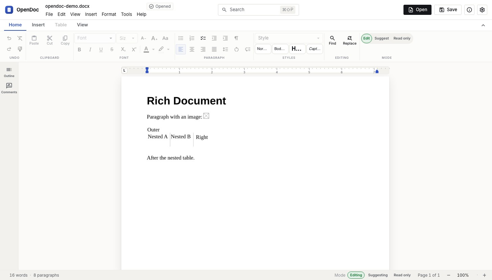

# OpenDoc

[](https://opendoc.casualoffice.org)
[](docs/06-ROADMAP-AND-DELIVERY.md)
[](rust-toolchain.toml)
[](LICENSE)

**A deterministic, embeddable Word-document engine written in Rust** — it reads
and writes `.docx`, holds the document in a normalized editable model, and lays it
out and renders it to pixels, for native, WebAssembly, and headless hosts that
need real DOCX fidelity without a browser, a server, or a UI framework.

The same engine compiles to WebAssembly and drives a **live in-browser editor** —
[open the bundled DOCX demo](https://opendoc.casualoffice.org/editor.html?demo=1)
or visit the [developer site](https://opendoc.casualoffice.org).

[](https://opendoc.casualoffice.org/editor.html?demo=1)

Developed by [CasualOffice](https://github.com/CasualOffice) as the document engine
for Casual Docs and an SDK others can embed.

## Why OpenDoc

Most ways to work with `.docx` force a trade-off: a full office suite you can't
embed, a converter that silently drops anything it doesn't understand, or a
browser editor that treats the DOM as the source of truth. OpenDoc is built the
other way around:

- **Loss-aware by design.** Content the semantic model doesn't yet represent is
  preserved and reproduced verbatim, or reported — never silently discarded.
- **Deterministic.** The same input, fonts, and engine version produce the same
  model, layout, and bytes, every time — so rendering can be regression-tested.
- **Embeddable and host-agnostic.** No mandatory DOM, server, React, or
  collaboration provider. The core targets Rust hosts, `wasm32-unknown-unknown`,
  desktop, and headless services alike.
- **Safe with untrusted files.** Packages are parsed under explicit entry, path,
  size, expansion, and resource limits.

## Features

- **DOCX import** into a normalized, editable model: paragraphs and runs with the
  full property tail, styles (`basedOn` chains) and theme, numbering, sections
  and page geometry, tables (merged cells, nested tables, borders, shading, cell
  margins), images and drawings, hyperlinks, fields, text boxes, footnotes and
  endnotes, headers and footers, comments, tracked changes, bookmarks, and
  content controls.
- **DOCX export** in two modes: byte-identical reconstruction of an unedited
  package, and a semantic writer that re-emits an *edited* model as a valid
  `.docx` that opens cleanly in LibreOffice.
- **Editing primitives**: grapheme-aware inserts/deletes, paragraph split/join,
  atomic transactions with semantic inverses, position mapping, revision-checked
  undo/redo, directed caret/range selection, and bounded ordered events.
- **Layout and rendering**: text shaping and line breaking via
  [`parley`](https://github.com/linebender/parley), an effective-property style
  cascade, pagination with break control, a backend-neutral display list, and a
  CPU raster backend that renders real pages and tables to PNG via
  [`tiny-skia`](https://github.com/RazrFalcon/tiny-skia) and glyph outlines from
  [`skrifa`](https://github.com/googlefonts/fontations).
- **In-browser editor** (WebAssembly): the engine compiled to
  `wasm32-unknown-unknown` drives a live editor — hit-testing, a custom
  engine-drawn caret and selection, incremental per-page repaint (sub-10 ms on a
  large document), text and run/paragraph formatting with type-in-format, lists,
  and table structure editing, all through a closed operation set with group
  undo/redo. See [Try it in your browser](#try-it-in-your-browser).

## Quickstart

OpenDoc builds from source. Install
[Rust](https://www.rust-lang.org/tools/install), then clone and test the
workspace:

```sh
git clone https://github.com/CasualOffice/opendoc.git
cd opendoc
cargo test --workspace --all-features --locked
```

Render the first page of a bundled sample document to a PNG — the full pipeline
(import → paginate → compose → raster):

```sh
cargo run -p casual-doc-render --example render_docx_page -- page.png
```

On native, the render crate resolves installed OS faces by default (useful for
CJK, symbol, and complex-script text the bundled Latin faces do not cover), so no
feature flag is needed:

```sh
cargo run -p casual-doc-render --example render_docx_page -- page.png
```

The repository pins Rust **1.96.0** through `rust-toolchain.toml` and supports
Rust **1.88.0** as its minimum supported version (MSRV). Every pull request runs
the build, test, lint, docs, and WASM gates on the pinned toolchain plus a
separate locked all-target check on the MSRV.

## Try it in your browser

**Live sample:
[opendoc.casualoffice.org/editor.html?demo=1](https://opendoc.casualoffice.org/editor.html?demo=1)**
— inspect and edit a bundled `.docx`, no install. To start with your own local
file, open the [blank editor](https://opendoc.casualoffice.org/editor.html).

`webapp/` is a zero-server harness that runs the engine as WebAssembly: open a
`.docx`, see it rendered exactly as the engine lays it out, and **edit it live** —
type with formatting, apply styles / fonts / sizes / colors, bulleted and numbered
lists, and tables (right-click a cell for row/column operations), with undo/redo
and save back to `.docx`. Nothing is uploaded; everything runs client-side. To run
it locally:

```sh
# Requires wasm-pack (https://drager.github.io/wasm-pack) and the pinned toolchain.
./webapp/build.sh     # compile the engine to webapp/pkg and wire the harness
./webapp/serve.py     # serve on http://localhost:8099 with no-cache headers
# then open the site at http://localhost:8099/
# or the editor at http://localhost:8099/editor.html?demo=1
```

The editor is a pre-release developer surface, not a stable SDK or supported
product. It is the browser-first environment where interaction and DOCX fidelity
are built and fine-tuned. Theme and accent color are customizable from the
in-app settings (⚙). See the architecture in
[Editor shell & render (Phase 1G)](docs/56-EDITOR-SHELL-AND-RENDER-ARCHITECTURE.md).

## Example

Import a `.docx` into the model and read back its content:

```rust
use casual_doc_import::{import_package, ImportConfig, ImportMode};
use casual_doc_ooxml::{DocxPackage, PackageLimits};

let bytes = std::fs::read("document.docx")?;
let mut package = DocxPackage::open(&bytes, PackageLimits::default())?;
let outcome = import_package(
    &mut package,
    ImportConfig { mode: ImportMode::Semantic, ..ImportConfig::default() },
)?;

let document = outcome.document;
// `document` is the normalized model: paragraphs, runs, styles, tables, …
// Anything not yet modeled is captured in the compatibility report, not lost.
```

## Status & limitations

**Pre-release** — a maturing engine, not a finished product. An honest picture:

**Works today** — DOCX **import → model → semantic write-back** (round-trips to a
LibreOffice-valid `.docx` and an identical model; unedited packages reconstruct
byte-for-byte); a structurally strong **layout/render** path (style cascade,
headers/footers, tables, floats with z-order, VML) that matches LibreOffice page
counts exactly on 3/5 corpus docs and within ±1 on the rest; and an **in-browser
editor** (WebAssembly) with hit-testing, a custom caret/selection, incremental
repaint, text/format/list editing, table structure editing, undo/redo, and save.

**Not yet** — the renderer is **not pixel-perfect Word-grade**: no text wrap
around floats, slightly tall CJK fallback metrics, a couple of ±1 page-count gaps,
some footer field-recompute edge cases. Footnote/endnote body placement, inline
math (OMML), and multi-column layout aren't done. A GPU backend, the Tauri desktop
shell, worker isolation, and a stable public SDK are not started.

The current focus is deeper DOCX fidelity. A stable public SDK, ODT/plain-text
and other format adapters, and native PDF export from the engine display list
are future goals rather than shipped capabilities.

Details: [fidelity gap analysis](docs/46-RENDERING-FIDELITY-GAP-ANALYSIS.md) ·
[support matrix](docs/18-SUPPORT-MATRIX.md).

## Workspace

| Crate | Responsibility |
| --- | --- |
| `casual-doc-sdk` | Host-facing engine and document-session facade |
| `casual-doc-model` | Normalized document values, IDs, invariants, and snapshot I/O |
| `casual-doc-transaction` | Atomic operations, inverses, and position mapping |
| `casual-doc-selection` | Logical caret/range validation and mapping |
| `casual-doc-ooxml` | Security-bounded OOXML package inspection |
| `casual-doc-import` | WordprocessingML semantic import into the normalized model |
| `casual-doc-export` | DOCX writers: byte-identical reconstruction and the semantic model → WordprocessingML writer |
| `casual-doc-layout` | Geometry, text shaping (`parley`), style cascade, block/flow galley, pagination, and the backend-neutral display list |
| `casual-doc-render` | CPU render backend: executes the display list on a `tiny-skia` pixmap, rasterizing glyphs from `skrifa` outlines |

Supporting tooling lives outside `crates/`: `tools/opendoc-benchmark`
(reproducible workloads and baselines), `tools/opendoc-fidelity` (LibreOffice
differential fidelity harness), and `fuzz/` (`opendoc-fuzz`, independently locked
package-reader fuzz targets). Internal crates are deliberately unpublished while
the architecture and public API contracts evolve.

## Roadmap

OpenDoc follows capability-gated delivery rather than feature claims based only
on design.

| Phase | Outcome | Status |
| --- | --- | --- |
| 0 | Runtime, model, package-safety, CI, corpus, and benchmark foundation | Complete |
| 1A | Semantic DOCX import + modeling (every construct family a first-class model value) | Complete |
| 1B | Semantic writer (model → valid editable `.docx`) | Complete |
| 1C | Typography and paragraph/block layout | Substantially implemented |
| 1D | Pagination and backend-neutral display list | Substantially implemented |
| 1E | CPU rendering; then WASM/GPU backends and hit testing | CPU rendering + hit testing implemented; GPU backend not started |
| 1G | In-browser editor (Rust→WASM): viewer, editing, tables | In progress (developer harness in `webapp/`) |
| 2 | Core editing SDK and DOCX save/reopen workflow | Planned |
| 3 | Advanced office-document features | Planned |
| 4 | Stable SDK surfaces and third-party embedding | Planned |
| 5 | Collaboration adapters and product migration | Planned |
| 6 | Stable 1.0 release | Planned |

Phases 1C–1E are structurally in place and improving in fidelity; they are not
yet declared complete. Development is **web-first and open-source-first**: the
editor is built and fine-tuned in the browser (Phase 1G, `webapp/`) before the
public editing SDK and the desktop (Tauri) shell, which are not started. None of
the rendering work above is a Word-grade or release claim. Detailed deliverables
and exit gates live in the [roadmap](docs/06-ROADMAP-AND-DELIVERY.md).

## Documentation

The numbered documents in [`docs/`](docs/) are the source of truth for accepted
architecture, behavior, and compatibility. Good entry points:
[architecture](docs/02-ARCHITECTURE.md) ·
[SDK API](docs/05-SDK-API-SPEC.md) ·
[roadmap](docs/06-ROADMAP-AND-DELIVERY.md) ·
[editor architecture (Phase 1G)](docs/56-EDITOR-SHELL-AND-RENDER-ARCHITECTURE.md) ·
[execution tracker](docs/14-EXECUTION-TRACKER.md).

## Contributing

Contributions are welcome through issues and pull requests. OpenDoc uses a
design-first workflow for substantial behavior and architecture changes:

1. Define the required outcome and constraints.
2. Record relevant specifications, compatibility evidence, and alternatives.
3. Discuss and accept the design.
4. Create or update the execution tracker item.
5. Implement with tests, documentation, and CI coverage.

Read [CONTRIBUTING.md](CONTRIBUTING.md) before starting work, and please follow
our [Code of Conduct](CODE_OF_CONDUCT.md). Governance and decision ownership are
documented in [GOVERNANCE.md](GOVERNANCE.md).

## Community

- **Questions and ideas:** open a
  [GitHub issue](https://github.com/CasualOffice/opendoc/issues).
- **Bugs:** file an issue with a minimal, non-confidential reproduction.

## Security

Do not report vulnerabilities, malicious fixtures, or confidential documents in
public issues. Follow [SECURITY.md](SECURITY.md) and use
[GitHub private vulnerability reporting](https://github.com/CasualOffice/opendoc/security/advisories/new).

## License

OpenDoc is available under the [Apache License 2.0](LICENSE).
