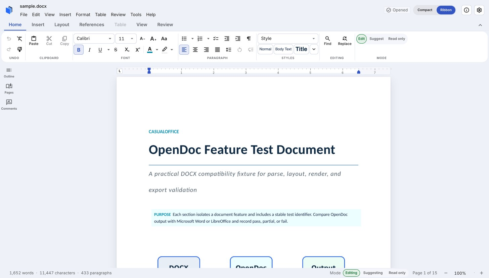

<p align="center">
  
</p>

# OpenDoc

[](https://opendoc.casualoffice.org)
[](docs/06-ROADMAP-AND-DELIVERY.md)
[](rust-toolchain.toml)
[](LICENSE)

**An Apache-2.0, embeddable, local-first editor for Word documents** — and the
deterministic Rust engine underneath it. OpenDoc reads and writes `.docx`, holds the
document in a normalized editable model, lays it out and paints it itself, and runs
the same engine natively, headless, or in the browser as WebAssembly. Nothing has to
run behind it: the editor opens, edits and saves a document entirely in the tab.

It is built as an open alternative to ONLYOFFICE Docs for documents: one you can
embed and brand without a commercial licence.

[Open the live editor with a sample document](https://opendoc.casualoffice.org/editor.html?demo=1) ·
[developer site](https://opendoc.casualoffice.org)

[](https://opendoc.casualoffice.org/editor.html?demo=1)

Developed by [CasualOffice](https://github.com/CasualOffice) as the document engine
for Casual Docs and an SDK others can embed.

## Why OpenDoc

- **Loss-aware by design.** Content the model does not yet represent is kept and
  written back verbatim, or reported in a compatibility report — never silently
  dropped. An unedited `.docx` saves back byte-for-byte.
- **Deterministic.** The same input, fonts and engine version produce the same model,
  layout, pixels and bytes, so rendering is regression-tested, not eyeballed.
- **Local-first.** No document server, no upload. The editor is a static web app;
  drafts and version history live in the browser's own storage.
- **Embeddable.** A custom element, an in-process API and a `postMessage` bridge, with
  roles, capabilities and build-time white-labelling. No React, DOM-as-model, or
  mandatory collaboration provider.
- **Safe with untrusted files.** Packages are parsed under explicit entry, path, size,
  expansion and resource limits, and macro-enabled `.docm` files are refused.

## What you can do in the editor today

- **Write and format** — styles (create and update from the selection), fonts, sizes,
  colours, paragraph spacing and indents, tab stops and the ruler, lists and
  multilevel numbering, format painter, smart quotes, change case, drop caps.
- **Tables** — insert, merge and split, borders and shading, cell formatting,
  row/column operations, move and reorder.
- **Objects** — pictures (crop, rotate, wrap, alt text, group), shapes (22 to insert;
  all 187 DrawingML presets and custom geometry render) and text boxes, and **charts**:
  drawn by the engine (bar, column, line, area, scatter, pie, doughnut), insertable,
  with an editable data grid, and saved back into the `.docx`.
- **Document structure** — headers and footers (first-page and odd/even), footnotes and
  endnotes, sections and breaks, page setup, line numbers, watermarks, a table of
  contents the engine generates and updates, captions and cross-references,
  bookmarks, hyperlinks and fields.
- **Review** — threaded comments with replies and resolve; tracked changes with
  Editing / Suggesting / Viewing modes, per-author colours, accept and reject one or
  all; a document's own Track Changes setting is honoured on open and saved; Restrict
  Editing (read-only, comments, tracked changes, forms).
- **Versions and compare** — a version timeline with named versions, a read-only
  preview with the changes painted on the page, non-destructive restore, download and
  copy; compare against another file as a redline on the canvas, or keep the
  differences as tracked changes.
- **Proofing** — offline spell check (English, US and UK) and grammar rules in a
  worker, with a personal dictionary.
- **Views** — paper layout, an editable pageless reflow view, a phone layout with touch
  selection, an outline pane, folding headings, page thumbnails, zoom, and a dark
  theme.
- **Find and replace, print** (as real-text PDF), document statistics, a command
  palette and keyboard shortcuts.
- **Accessibility** — a screen-reader mirror of the document's structure (headings,
  lists, tables, alt text), F6 region navigation, arrow-key ribbon navigation and key
  tips; WCAG contrast is measured in CI.
- **19 interface languages** (machine-translated, marked as such), with a mirrored
  chrome for right-to-left languages.

## Formats

| Format | Open | Save / export |
| --- | :---: | :---: |
| Word (`.docx`) | yes | yes — byte-identical when unedited |
| Word template (`.dotx`) | opens as a document | yes |
| OpenDocument Text (`.odt`) | yes | yes |
| Rich Text (`.rtf`) | yes | — |
| PDF | — | yes — real, selectable text with embedded, subsetted fonts |
| Web page (`.html`) | — | yes — one self-contained file, styled the way the page is |
| Markdown (`.md`) | — | yes |
| Plain text (`.txt`) | yes | yes |
| Normalized JSON snapshot | yes | yes |

Every export reports what it could not carry. A `.docm` file is refused at open.

## The engine

The editor is a thin shell over a Rust engine that owns everything a document is:

- **Import** — WordprocessingML, ODF and RTF into one normalized, versioned model:
  styles and themes, numbering, sections, tables, drawings and charts, fields, notes,
  headers and footers, comments, tracked changes, bookmarks, content controls and
  OMML math.
- **Editing** — a closed operation set applied through transactions, each with its
  inverse, so undo/redo, collaboration and history share one mutation path.
- **Layout and paint** — shaping and line breaking with
  [`parley`](https://github.com/linebender/parley), a full style cascade, pagination
  with keep and widow rules, floats with tight/through contour wrapping, the document
  grid, all 187 ECMA-376 preset shapes and custom geometry, charts, and math, into a
  backend-neutral display list.
- **Output** — a CPU rasterizer ([`tiny-skia`](https://github.com/RazrFalcon/tiny-skia)
  with [`skrifa`](https://github.com/googlefonts/fontations) outlines, including COLR
  and bitmap colour glyphs), a vector PDF writer, and DOCX, ODT, HTML, Markdown and
  text writers.
- **Diff** — a structural comparison of two documents (blocks, moves, words, formatting,
  styles, lists, tables) that drives version history and Compare.

## Collaboration (experimental)

Real-time co-editing is built from operational transformation over the same
transactions (ADR-033) and an optional relay, `opendoc-relay`, that orders and
forwards changes and never holds the document (ADR-047). Rooms carry a role —
viewer, commenter, suggester, editor or owner — that caps every participant.

It is **not on the public demo yet**, and it is not a product surface: there is no
Share button, presence and remote cursors are not shown, and each participant opens
the same file themselves. To try it locally, see
[deployment §5](docs/162-DEPLOYMENT-CONTAINERS-AND-CONFIGURATION.md):

```sh
docker compose run --rm relay create /var/lib/opendoc-relay/room.journal
docker compose --profile relay up --build
# then open the editor with ?room=ws://localhost:7070
```

## Quickstart

Install [Rust](https://www.rust-lang.org/tools/install), then clone and test the
workspace:

```sh
git clone https://github.com/CasualOffice/opendoc.git
cd opendoc
cargo test --workspace --all-features --locked
```

Render the first page of a bundled sample to a PNG — the whole pipeline (import →
paginate → compose → raster):

```sh
cargo run -p casual-doc-render --example render_docx_page -- page.png
```

Run the editor locally:

```sh
# Requires wasm-pack (https://drager.github.io/wasm-pack) and the pinned toolchain.
./webapp/build.sh     # compile the engine to webapp/pkg and build the pages
./webapp/serve.py     # serve on http://localhost:8099 with no-cache headers
# then open http://localhost:8099/editor.html?demo=1
```

Or run it as a container: `docker compose up` starts the editor alone, with no server
behind it ([deployment](docs/162-DEPLOYMENT-CONTAINERS-AND-CONFIGURATION.md)).

The repository pins Rust **1.96.0** through `rust-toolchain.toml` and supports Rust
**1.88.0** as its minimum (MSRV). Every pull request runs format, lint, tests, docs,
WebAssembly, browser, fuzz-build and benchmark gates on the pinned toolchain, the
full test suite on Windows and macOS, and an all-target check on the MSRV.

## Embedding

Put the editor in your own page as `<opendoc-editor>` (from
[`packages/opendoc-embed`](packages/opendoc-embed), not yet published to npm), drive
it in-process through `window.opendoc`, or from another origin through a versioned
`postMessage` contract with an explicit origin allowlist. A host chooses the role
(preview, read-only, commenter, editor, owner), the capabilities (open, save,
download, print, edit, comment, autosave, branding) and the chrome, and receives
`ready`, `change`, `selection`, `save`, `export`, `error` and `refusal` events. See
the generated [embedding guide](https://opendoc.casualoffice.org/embedding.html) and
[the SDK plan](docs/126-EMBEDDABILITY-AND-SDK-THREE-PHASE-PLAN.md).

A host cannot yet hand a document to the editor by URL or bytes; the user opens it.

Use the engine directly from Rust:

```rust
use casual_doc_import::{import_package, ImportConfig, ImportMode};
use casual_doc_ooxml::{DocxPackage, PackageLimits};

let bytes = std::fs::read("document.docx")?;
let mut package = DocxPackage::open(&bytes, PackageLimits::default())?;
let outcome = import_package(
    &mut package,
    ImportConfig { mode: ImportMode::Semantic, ..ImportConfig::default() },
)?;

let document = outcome.document;
// `document` is the normalized model: paragraphs, runs, styles, tables, …
// Anything not yet modeled is captured in the compatibility report, not lost.
```

## Status and limitations

**Pre-release.** The editor is usable and tested end to end, but the public SDK
surfaces are not stable and the internal crates are not published. Known gaps, all
tracked in [the backlog](docs/109-BACKLOG.md):

- **Rendering is not yet identical to Word.** It is measured against LibreOffice as
  an oracle ([fidelity harness](docs/94-ORACLE-VISUAL-FIDELITY-HARNESS-DESIGN.md));
  there is no automatic hyphenation, and the character grid (`charSpace`) is not
  applied.
- **SmartArt** is kept for round trip and shown as a placeholder; **3-D, radar,
  surface, stock and bubble charts** likewise. Equations render and round-trip but
  cannot be edited or inserted.
- **RTF** opens but cannot be saved. The **PDF** export has no tags, links,
  bookmarks or PDF/A yet, and does not carry colour emoji.
- **Collaboration** is experimental (see above); version history is stored in the
  browser, not on a server.
- **Spell check** is English only, and the 18 non-English interface languages are
  machine-translated and not yet reviewed.
- 20 of the 24 document font faces are served by the editor itself; the CJK and
  colour-emoji faces come from a pinned, hash-verified mirror unless the deployment
  provisions them. There is no offline service worker.
- Not authorable yet: drawing custom shape geometry, creating SmartArt, and a recent
  files list.

More: [support matrix](docs/18-SUPPORT-MATRIX.md) ·
[ONLYOFFICE parity matrix](docs/153-ONLYOFFICE-CAPABILITY-PARITY-MATRIX.md) ·
[what is still missing](docs/99-REMAINING-WORK-AUDIT.md).

## Workspace

| Crate | Responsibility |
| --- | --- |
| `casual-doc-model` | Normalized document values, IDs, invariants, and snapshot I/O |
| `casual-doc-package` | Format-neutral, security-bounded ZIP admission and part reads |
| `casual-doc-ooxml` | Security-bounded DOCX package admission and on-demand part reads |
| `casual-doc-import` | WordprocessingML import into the normalized model |
| `casual-doc-odf` | Security-bounded ODF admission, ODT import, and bounded ODT writing |
| `casual-doc-rtf` | Security-bounded RTF admission and import |
| `casual-doc-export` | DOCX writers: byte-identical re-emission and the semantic model → WordprocessingML writer, charts included |
| `casual-doc-pdf` | Real-text vector PDF from the shared display list, with subsetted embedded fonts |
| `casual-doc-io` | Format identities, capability descriptors, detection, the adapter registry, and the HTML, Markdown and text writers |
| `casual-doc-edit` | The closed set of editing operations, each returning its inverse |
| `casual-doc-transaction` | Transactions and the ordered revision log — the one mutation path — plus the collaboration session and transform |
| `casual-doc-selection` | Validated caret, text-range and table-cell-range selection |
| `casual-doc-diff` | Structural difference between two documents, for version history and Compare |
| `casual-doc-layout` | Style cascade, shaping, flow, pagination, charts and shapes, and the backend-neutral display list |
| `casual-doc-render` | CPU rasterization of the display list (`tiny-skia`, `skrifa`, colour glyphs) |
| `casual-doc-sdk` | Host-facing engine and document-session facade |
| `casual-doc-wasm` | WebAssembly bridge: the document session, edit operations and page raster the editor drives |
| `opendoc-relay` (`server/`) | Optional collaboration relay that orders and forwards changes and holds no document |

Tooling: `tools/opendoc-benchmark` (reproducible workloads and baselines),
`tools/opendoc-fidelity` (geometry and text compared against LibreOffice),
`tools/opendoc-parity` (derives the [ONLYOFFICE parity
matrix](docs/153-ONLYOFFICE-CAPABILITY-PARITY-MATRIX.md)), `tools/opendoc-render`
(batch page renders for visual regression), and `fuzz/` (independently locked
package-reader fuzz targets). The browser editor and the developer site are in
[`webapp/`](webapp/).

## Roadmap

Delivery is capability-gated: a feature is claimed when it is built and tested, not
when it is designed. The direction is the [Apache-2.0 alternative to ONLYOFFICE
Docs](docs/106-ONLYOFFICE-ALTERNATIVE-ROADMAP.md); the order work is done in is
[the backlog](docs/109-BACKLOG.md), the single queue; phases and exit gates are in
[the roadmap](docs/06-ROADMAP-AND-DELIVERY.md).

| Area | State |
| --- | --- |
| Engine: model, import, semantic DOCX writer | Built |
| Layout, pagination, CPU rendering, PDF | Built, improving in fidelity |
| Browser editor (`webapp/`) | Built and tested end to end, pre-release |
| Review, versions, compare | Built |
| Embedding: element, API, `postMessage` contract | Built; package not yet published |
| Real-time collaboration | Engine and relay built; product surface (sharing, presence) not yet |
| Stable public SDK and published crates | Planned |
| Desktop shell, GPU backend | Not started |

## Documentation

The numbered documents in [`docs/`](docs/) are the source of truth for accepted
architecture, behaviour and compatibility, listed in [the docs index](docs/00-README.md).
Good entry points:
[architecture](docs/02-ARCHITECTURE.md) ·
[decisions (ADRs)](docs/08-ADR-REGISTER.md) ·
[SDK API](docs/05-SDK-API-SPEC.md) ·
[editor architecture](docs/56-EDITOR-SHELL-AND-RENDER-ARCHITECTURE.md) ·
[collaboration protocol](docs/152-COLLABORATION-PROTOCOL-SESSION-AND-IDENTITY.md) ·
[deployment](docs/162-DEPLOYMENT-CONTAINERS-AND-CONFIGURATION.md) ·
[backlog](docs/109-BACKLOG.md).

## Contributing

Contributions are welcome through issues and pull requests. OpenDoc uses a
design-first workflow for substantial behaviour and architecture changes:

1. Define the required outcome and constraints.
2. Record relevant specifications, compatibility evidence, and alternatives.
3. Discuss and accept the design.
4. Add or update the row in [the backlog](docs/109-BACKLOG.md).
5. Implement with tests, documentation, and CI coverage.

Read [CONTRIBUTING.md](CONTRIBUTING.md) before starting work, and please follow
our [Code of Conduct](CODE_OF_CONDUCT.md). Governance and decision ownership are
documented in [GOVERNANCE.md](GOVERNANCE.md).

## Community

- **Questions and ideas:** open a
  [GitHub issue](https://github.com/CasualOffice/opendoc/issues).
- **Bugs:** file an issue with a minimal, non-confidential reproduction.

## Security

Do not report vulnerabilities, malicious fixtures, or confidential documents in
public issues. Follow [SECURITY.md](SECURITY.md) and use
[GitHub private vulnerability reporting](https://github.com/CasualOffice/opendoc/security/advisories/new).

## Authorship and license

OpenDoc is developed by the CasualOffice Team, copyright 2026 CasualOffice, and
is licensed under the [Apache License 2.0](LICENSE).

Contributions are welcome under the same license: unless you state otherwise, a
contribution you submit for inclusion in OpenDoc is provided under Apache-2.0,
without additional terms or conditions. [CONTRIBUTING.md](CONTRIBUTING.md) has
the workflow, and [GOVERNANCE.md](GOVERNANCE.md) records who decides what.

[NOTICE](NOTICE) carries the attribution notice and the third-party works this
repository ships — the bundled document fonts, the interface fonts, and the
SCOWL word lists behind the spelling dictionaries — each with the committed
license file it is taken from.
