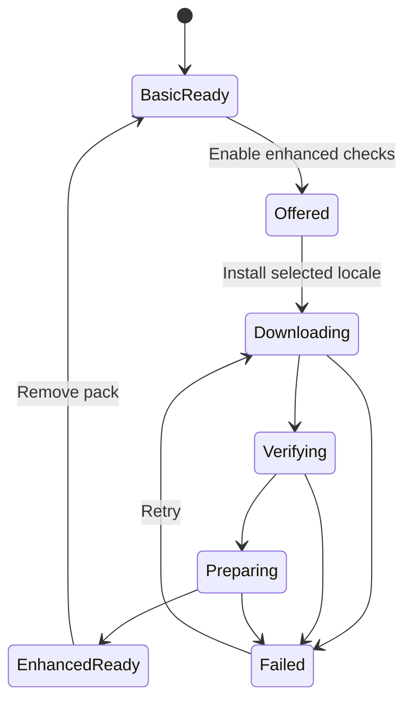
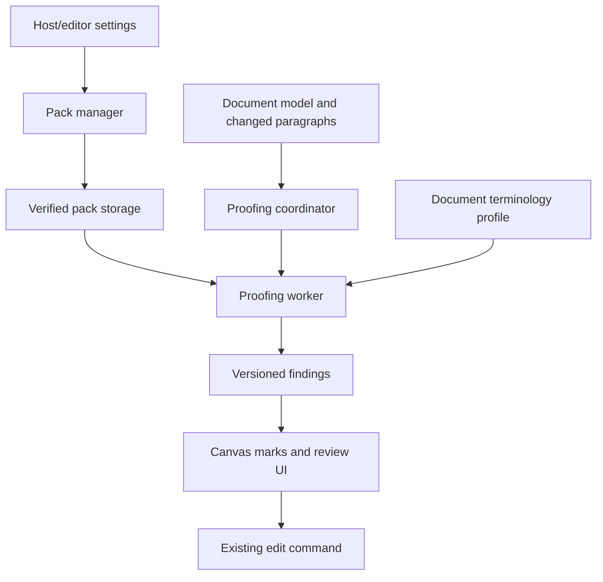

# 146 — Client-side proofing architecture

**Status: PROPOSED design, partly built.** Written by the owner on 2026-09-28 and brought
into the repository unchanged below the divider — its text is the owner's and is not edited
except where an implementation **falsified** it, which is marked `VERIFIED` /  `CORRECTION`
in place, the way `docs/114` already marks its own four. It supersedes nothing: `docs/114`
stays the record of **what shipped**, and this is the plan for what comes next.

**Decisions:** ADR-042. **Predecessor:** `docs/114` (proofing as shipped). **Owner:** unassigned.

## What is being built, and what is not

§10 sequences the work as five increments. **Only Increment A — stability — is being built**,
and this is what that means concretely (§8's own ordering):

| §8 row | In this increment | State |
| --- | --- | --- |
| P0 — review the design, add an ADR and a tracker item | yes | this document + **ADR-042** |
| P1 — decouple grammar-only scanning from dictionary loading | yes | built; the §2 claim is corrected below |
| P1 — pure contracts, move checking to a worker | yes | `proof_protocol.mjs` (pure) + `proof_worker.mjs` |
| P1 — pack manifest, install manager, proofing store | **no** | Increment B; several open decisions |
| P2 — document terminology profile | **no** | Increment C |
| P2 — curated rules and confusion pairs | **no** | Increment C/D; corpus licence still open |
| P3 — mixed-language spans and non-body stories | **no** | Increment E; see the note below |
| P3 — `w:noProof`, tracked changes and exclusions | **no** | Increment E |

Increment A also carries §9's first correctness bullet — stale-finding rejection during
edits, and UTF-16 ↔ UTF-8 offset round-trips over combining characters, emoji, RTL and mixed
scripts — because those are the guards that make the worker boundary safe rather than merely
present.

### One finding that belongs here rather than in a later surprise

§8 ranks non-body stories at P3, and surveying the engine while building Increment A
confirmed that ranking is right for a mechanical reason, not a scheduling one:

- `hitTest` walks `page.placed` only — the **body** fragments — so a probe into the header
  band answers with a body node snapped in from the margin. It can never seed a header,
  footer, note or text-box paragraph.
- `moveCaret` `"left"`/`"right"` **deliberately stop at a story boundary**, which is exactly
  the property the windowed walk in `spell_check.mjs` is built on.
- Painting is **not** the problem: `selectionRects` already resolves geometry for a header,
  footer, note or text-box node, and `place()` is story-agnostic. Review markers reach those
  nodes today through that same pair.

So the blocker is **enumeration**, and it is in the engine, not the host: headers and footers
and text boxes have model-based entry points (`runningContentCaret`, `textBoxCaret`) that a
scan could use, but footnote and endnote bodies have **no route at all** and need a new
export. That is `crates/**` work owned by another lane, and it is why this stays at P3.

### What building Increment A found that the design did not ask about

Recorded here rather than only in the PR (SKILL.md §8). All three are about the
boundary the increment introduces, and none of them is visible from the design:

1. **A module worker's top-level `await` drops the messages already queued for
   it.** Queued messages are delivered once the script finishes its *initial*
   evaluation, and top-level `await` ends that evaluation at the first
   suspension — so a `message` listener registered after the `await` does not
   exist yet, and everything waiting is discarded. The first message is the one
   carrying the word list, and resources are sent once, so the worker then
   answers every later check with grammar findings only, for ever. No error, no
   warning, a healthy worker, a clean console, and a document that is simply
   never spell-checked — measured in roughly half of a two-worker browser run.
   The listener now goes on in the first synchronous statement and early
   messages are queued in the worker.
2. **The cache key has to name the RESOURCES, not just the document.** §4's
   tuple does say `activePackVersion`, and this is why it matters before any
   pack exists: a check posted before the word list arrives is answered
   correctly, with grammar only, and that answer is written into the cache under
   a key the re-check *after* the list arrives computes identically. The
   re-check hits, and nothing is ever spell-checked. Nothing about the document
   changed; the resources did. So the key carries how much of the pack has
   loaded, and a reply is matched against **the key it was computed under**,
   echoed back by the worker — which is also §4's "verify document ID and
   paragraph revision", since both are fields of that key.
3. **A cap on the worker queue must not become a stall.** At most one check is
   in flight (§4, "budget and cap the worker queue"), and the first version of
   that had no way out if a reply never came: nothing else would attempt another
   scan until the reader happened to scroll. A coalesced scan now re-arms
   itself, an unanswered check stops blocking after a grace period, and a worker
   that has not said it is alive within a deadline is replaced by the in-process
   responder.

The shape of all three is the same, and it is worth stating once: **a worker
boundary turns "nothing happened" into a legitimate-looking outcome.** Every
one of these presented as a clean document.

---

*Everything below this line is the owner's document of 2026-09-28, reproduced as written.*

# OpenDoc client-side proofing architecture

**Status:** Proposed design for review  
**Date:** 2026-09-28  
**Scope:** Spelling, grammar, contextual word choice, document terminology, and optional language-pack installation in the browser.  
**Target:** The current OpenDoc web editor and its reusable document engine. This is a design, not a claim that the proposed features are implemented.

## 1. Decision summary

Extend OpenDoc's existing proofing seam into a versioned, optional **language-pack system**. Keep the document model and editing commands authoritative. Perform proofing in a dedicated Web Worker; download only the selected language and selected enhancement tier; cache verified pack assets locally; and maintain a small, revision-aware profile of terminology in each open document. Ship the initial enhancement as curated grammar rules and confusion-pair ranking. Do not download or construct a general web-scale n-gram index in the browser.

The first proofing result should remain available from the existing English word lists and rules while enhanced assets prepare. A pack's download or index failure must never block editing or look like a clean document.

### Goals

- Helpful corrections for spelling, high-confidence grammar, confused words, and inconsistent document terminology.
- Explicit first-use installation with progress, size, offline state, and a removal control.
- No document upload or mandatory server; host applications continue to own network and storage policy.
- Bounded memory, predictable typing latency, and no document-length scan on the keystroke path.
- Stable positions, undoable replacements, Suggesting-mode behavior, and honest handling of unsupported languages.
- Independently versioned language data with reproducible builds and license provenance.

### Non-goals for the first release

- LanguageTool-equivalent coverage; general prose rewriting; automated changes without user review.
- Training a language model or a general corpus index in each user's browser.
- Treating one document's wording as proof of grammatical correctness.
- Full cross-story checking until the editor can enumerate headers, footers, notes, text boxes, and other stories safely.

## 2. Current implementation and concrete gaps

OpenDoc already has a stronger base than a blank proofing project:

| Existing capability | Repository location | Extension needed |
| --- | --- | --- |
| English US/UK SCOWL lists, two frequency tiers and deterministic generator | `webapp/dict/`, `webapp/tools/build-dictionary.mjs` | Pack manifests, verification, install/update state; optional compact indexes |
| Tokenization, skip rules, edit-distance suggestions, paragraph cache and scheduler | `webapp/src/spelling.mjs` | Worker-friendly interfaces and bounded candidate lookup |
| Lazy fetch, visible-window scan, squiggles and context actions | `webapp/src/spell_check.mjs` | Separate extraction/painting from checking; result revision checks |
| Eight hand-authored English grammar rules | `webapp/src/grammar.mjs` | More rules, explicit rule registry, regression corpus and confidence policies |
| Personal dictionary in IndexedDB; generated product glossary | `webapp/src/drafts.mjs`, `webapp/dict/glossary.txt` | Per-document terminology layer; pack metadata stored separately |
| Language information from DOCX `w:lang` | `languageAt` in `crates/casual-doc-wasm/src/lib.rs` | Mixed-language spans and explicit document/profile fallback policy |
| Undoable replacement through existing commands | `webapp/src/spell_check.mjs` and host adapter | Keep this as the sole mutation path for corrections |

The current [design document](https://github.com/CasualOffice/opendoc/blob/main/docs/114-SPELL-CHECK-DESIGN.md) calls out body-only scanning, no `w:noProof` handling, and no contextual grammar beyond the first rules. The current [scanner](https://github.com/CasualOffice/opendoc/blob/main/webapp/src/spell_check.mjs) also appears to request and wait on the language dictionary even when spelling is disabled and grammar alone is enabled. Verify and decouple those paths in the first increment. Its cache key already includes language and enabled passes; the new key must additionally account for pack version, rule configuration and document-profile revision.

> **VERIFIED, and the claim is half right — the other half is worse.** Driven against the
> real `createSpellChecker` with a fake engine (`tests/spell_check.test.mjs`):
>
> 1. **Grammar does NOT wait on the language dictionary.** `dictionary(language)` is
>    called only when spelling is on, so a grammar-only scan never asks for a word list.
>    What it *does* fetch is the **glossary** — `loadGlossary()` runs unconditionally at
>    the top of the scan — which is a spelling asset a grammar pass has no use for. So the
>    coupling is real but it is to the glossary, not to the dictionary.
> 2. **It does wait while a spelling asset is in flight.** With spelling on, a paragraph is
>    `continue`d whole until both the word list and the glossary have resolved, so grammar
>    marks are withheld behind a fetch they do not need.
> 3. **CORRECTION — a dictionary that fails to load underlines every word in the
>    document.** The failure path installs `emptyDictionary()` as that language's word
>    list, and an empty word list means no word is known. Measured: a one-paragraph
>    document with a single deliberate typo produced **eight** spelling marks, one per
>    word, while the status line said the dictionary could not be loaded. That is this
>    document's own gate — "a pack's download or index failure must never block editing or
>    look like a clean document" — failed in the opposite direction, which is worse,
>    because a document that is uniformly wrong teaches the reader to ignore the marks.
>
> Fixed in the same increment: a language whose list failed is held as **unavailable**
> rather than as empty, spelling is skipped for it and said so by name, and the two passes
> are decided per paragraph and independently, so grammar is painted whatever the spelling
> assets are doing.

> **DEVIATION — the result cache stays on the coordinator, not in the worker.** §4 puts it
> in the worker. Keeping it on the coordinator means an unchanged window costs **zero**
> messages rather than one round trip per paragraph, and there is then one cache rather
> than two caches of the same thing. The key is the one §4 specifies, built by
> `proofCacheKey()` in `proof_protocol.mjs`; `profileRevision` is in the key's shape and is
> constant until Increment C gives it something to carry, which is stated at the call site
> rather than left for a reader to infer.

**Repository rule:** `AGENTS.md` requires substantial design to be reviewed before implementation, tracker/ADR updates, and edits via commands and transactions. The recommended order below follows that workflow.

## 3. User experience and first-use setup

### Entry points

- **Writing > Proofing:** Spelling, Grammar, Context suggestions and Document consistency switches. Separate switches let a user keep the fast built-in checks without downloading an enhanced pack.
- **Writing language:** Auto from document `w:lang`, with an explicit default such as en-US or en-GB. Show what actually applies to the selection and when a language has no pack.
- **Manage languages:** Installed version, size on device, capabilities, last verification, update/remove/retry controls.
- **Suggestion popover:** Category, short reason, replacements, Ignore once, Ignore rule, Add word, and a brief “Why?” explanation when relevant.

### Setup state machine



The initial dialog shows the **actual manifest byte size**, expected additional local storage, and which capabilities the pack enables. Download starts on an explicit install action. Show separate download and preparation progress. Keep editing usable in every state. If offline, offer basic proofing and show when enhanced checking is unavailable. “Installed” means the verified assets and usable index are committed together, not merely that fetch completed.

**Target, subject to measurement:** Basic checking starts after its existing lazy asset load; enhanced pack setup should complete within tens of seconds on a typical desktop connection and remain tolerable on a midrange phone. Do not advertise a fixed duration before cold-start benchmarks. Downloads should be cancelable and resume or restart safely.

## 4. Component architecture



### Host policy boundary

The reusable engine exposes pure proofing interfaces and does not choose a CDN, storage backend, analytics endpoint or permission policy. The webapp supplies a `PackProvider`, `PackStore` and worker transport. An embed host may substitute a corporate pack URL or disable downloads. Core document bytes never go to a proofing service as part of this design.

### Pack manager

Fetches the manifest, validates its schema and supported engine API version, chooses the correct locale/tier, checks available quota, downloads with cancellation, hashes bytes, builds or loads indexes, and atomically changes the active pack pointer. An update keeps the previous usable pack until the replacement is ready. Garbage-collect an older pack only after successful activation and once no active worker uses it.

### Coordinator

Receives `changedParagraphIds`, visible-page/window changes, language changes and pack changes. It extracts plain text from the document model and maps each paragraph's stable ID and revision to its text, language spans and proofable ranges. Queue visible paragraphs first; scan the rest only during idle time or an explicit “Check document” action. Preserve the existing debounce; never wait for proofing in a typing transaction.

### Worker

Owns loaded dictionaries, compiled rules, candidate indexes and the bounded document profile. Its stages are: tokenize → suppress unproofable ranges → spelling → grammar → confusion candidates → consistency → rank/deduplicate → findings. Cache by `(documentId, paragraphId, paragraphRevision, locale, activePackVersion, settingsRevision, profileRevision)`. Limit input and result size per message. Abort or supersede stale work.

### Presentation and mutation

The editor receives immutable findings. Before painting or replacing, verify document ID and paragraph revision; discard stale findings. Convert JavaScript string offsets to the Rust engine's UTF-8 byte offsets only at the document adapter boundary. Keep red/blue category styling and allow a distinct treatment for tentative word-choice advice. A click invokes the existing undoable replacement command; Viewing and Suggesting modes retain their current policy.

## 5. Data contracts

```ts
interface PackManifest {
  schemaVersion: 1;
  packId: string;           // e.g. casual-proof-en-US-enhanced
  locale: string;           // BCP 47
  packVersion: string;      // immutable release identifier
  engineApiRange: string;
  capabilities: Array<"spelling" | "grammar" | "context" | "consistency">;
  assets: Array<{
    id: string;
    url: string;            // resolved by host policy, same-origin by default
    bytes: number;
    sha256: string;
    format: string;
  }>;
  provenance: Array<{ name: string; version: string; license: string; url: string }>;
}

interface ProofInput {
  requestId: string;
  documentId: string;
  paragraphId: string;
  paragraphRevision: number;
  text: string;
  languageSpans: Array<{ start: number; end: number; locale: string }>;
  excludedSpans: Array<{ start: number; end: number; reason: string }>;
  profileRevision: number;
  settingsRevision: number;
}

interface ProofFinding {
  requestId: string;
  documentId: string;
  paragraphId: string;
  paragraphRevision: number;
  start: number;            // UTF-16 index in ProofInput.text, exclusive end
  end: number;
  locale: string;
  kind: "spelling" | "grammar" | "word-choice" | "consistency";
  ruleId: string;
  message: string;
  replacements: Array<{ text: string; score?: number }>;
  confidence: number;
  packVersion: string;
}
```

The wire representation uses UTF-16 indices because the JS worker operates on JS strings. The coordinator must validate offset boundaries (including surrogate pairs) and convert to engine byte positions using the existing conversion utility. Never store canvas coordinates as the finding's identity; layout changes invalidate them.

## 6. Pack format, download and local indexing

### Tiers

| Tier | Typical contents | When loaded |
| --- | --- | --- |
| Basic | Existing per-locale dictionary, existing rules, product glossary | Lazy first check; maintain existing behavior |
| Enhanced | Additional rules, exception tables, confusion sets, compact phrase counts, candidate lookup index | Only after user enables and installs it |
| Document profile | Terms and preferences extracted from the open document | Incrementally after document open and edits |

A pack is built **offline by the project build pipeline**, not generated from an online corpus on the user's device. Use reproducible inputs, pinned versions, checksums, and provenance. Prefer a compact read-only lookup structure or sorted table over thousands of IndexedDB rows. For an early release, a few dozen confusion sets and a pruned bigram/trigram table can fit a measured, explicit download budget. The size should be set after corpus licensing and a quality benchmark, not guessed here.

### Storage choices

- **IndexedDB:** pack manifest/state, active-version pointer, user settings and personal dictionary. Keep the existing `opendoc-drafts` data safe; a separate database such as `opendoc-proofing` reduces migration coupling.
- **Cache API:** immutable, versioned response assets that can be re-fetched after eviction. Exact URL/version and hash are essential.
- **OPFS:** optional for a generated binary index only if benchmarks show faster loading or bounded memory versus a plain fetched binary. Provide a fallback path where needed.
- **Memory:** only the active locale and a bounded number of decoded tables. Release on disable/document close; avoid keeping both old and new decoded packs in memory indefinitely.

Browser quotas and eviction vary. Treat all pack files as disposable and reconstructible; treat user-added words and settings as valuable user data. `navigator.storage.persist()` may improve retention but does not replace recovery logic. In private browsing or restricted embeds, storage may be unavailable; basic session-only checking should still work where possible.

### Install algorithm

1. Resolve explicit locale, current manifest, and host download permission.
2. Compare required bytes with `navigator.storage.estimate()` where available; ask for the actual download with its size shown.
3. Fetch assets with an `AbortController`; report byte progress. Limit parallel requests.
4. Verify SHA-256, format version, declared bounds and maximum uncompressed size before parsing. Never evaluate downloaded rules as JavaScript.
5. Prepare the lookup index in a worker, writing a temporary version namespace.
6. Run a small pack self-test (known positive and negative examples).
7. Atomically switch the active-version record; tell workers to load the new version.
8. Remove temp data on failure; retain the old usable version; allow retry.

If an origin is embedded under different sites, test storage behavior explicitly: browsers may partition storage in third-party iframe contexts. The SDK host should be able to provide pack bytes rather than assuming a shared origin cache.

## 7. Checking and ranking algorithm

### Spelling

Retain SCOWL membership and personal/product glossary layers. Candidate generation remains on demand. The current suggestion implementation can scan the word list for distance-two candidates; add a bounded candidate index (for example deletion signatures or a length/prefix partition) **only if profiling identifies this as a hot spot**. Compare accuracy and memory before changing it. Apply locale-specific casing and morphology rules where validated; do not treat an English dictionary as a general multilingual tokenizer.

### Rule grammar

Create a rule registry with `id`, locale, category, pattern or evaluator, severity, safe replacement, exceptions, positive examples and negative examples. Compile declarative rules inside the worker; keep special-case code for genuinely structural rules. Cap regex complexity and paragraph size so a malformed or adversarial document cannot hang the worker. Start with high-precision additions: punctuation around quotes, repeated short phrases, locale-specific spacing, and well-defined agreement forms. Rules that require part-of-speech information should wait for a validated tagger or stay suppressed.

### Contextual word choice

Begin with curated alternatives such as `their/there/they're`, `its/it's`, and `affect/effect`. For each occurrence, score the original and plausible alternatives using compact corpus counts and smoothing, then apply rule constraints and document context. Show a finding only when score margin and minimum evidence thresholds pass. This is a ranking signal, not a grammar proof. Evaluate false positives especially on names, quotations, dialects, technical prose, and short fragments.

### Document profile

Maintain a bounded, incremental map of terms and variants across the current document:

- Normalize Unicode consistently, retain original display forms, and distinguish case-sensitive acronyms.
- Require repeated occurrence or explicit user acceptance before using a term to suppress a spelling error.
- Compare candidate spellings with repeated terms (e.g. `OpenDoc` versus `OpenDco`), but never mark every uncommon word as wrong.
- Detect inconsistent variants only at high confidence; explain which form is used elsewhere and where.
- Rebuild from document content after reload if a persisted profile is unavailable. Do not automatically promote document terms to the user's global dictionary.
- Exclude hidden/deleted or `w:noProof` content once model support is added; define policy for tracked insertions and comments.

The profile is data about the current document, not a replacement for external language data. A single document cannot establish that a phrase is generally grammatical.

## 8. Prioritized repository changes

| Order | Change | Files or seam | Completion condition |
| --- | --- | --- | --- |
| P0 | Review this design, add ADR and tracker item | `docs/`, `docs/14-EXECUTION-TRACKER.md` | Scope, pack license policy and host contract agreed |
| P1 | Decouple grammar-only scanning from dictionary loading | `webapp/src/spell_check.mjs` | Grammar works with spelling off and dictionary fetch failure |
| P1 | Define pure contracts and move checks to worker | New `proof_worker.mjs`, `proof_protocol.mjs`; adapt `spelling.mjs`, `grammar.mjs`, `spell_check.mjs` | Same existing results and editing behavior, no blocking work on typing path |
| P1 | Pack manifest, install manager and separate proofing store | New `proof_packs.mjs`, `proof_store.mjs`, `webapp/packs/`; host policy adapter | Atomic install/update/removal and offline reopen |
| P2 | Incremental document terminology profile | New pure `document_profile.mjs`; coordinator/model extraction | Editing one paragraph updates only affected profile entries |
| P2 | Curated rules and confusion pairs | New generated data plus builder; rule registry | Measured false-positive and recall gates pass |
| P3 | Mixed-language spans and non-body stories | WASM model API and coordinator | Each supported story/range gets correct language and offsets |
| P3 | `w:noProof`, tracked changes and exclusions | Import/model and proof input | Skipped content is never underlined or replaced |

Naming is illustrative. Keep the public SDK surface small: `configureProofing`, `installPack`, `removePack`, `checkRange/checkDocument`, `onFindings`, and `dispose`, with network and storage providers injected by the host. Do not move browser APIs into Rust document-model crates.

## 9. Verification and quality gates

- **Correctness:** Round-trip UTF-16 ↔ UTF-8 offsets for combining characters, emoji, RTL text and mixed scripts. Verify stale finding rejection during edits, undo/redo, replacement in Editing/Suggesting/Viewing, and no document mutation from checks.
- **Pack lifecycle:** Fresh install, cancel, restart, corrupted hash, unsupported schema, insufficient quota, offline reopen, storage eviction, update rollback, concurrent tabs, and iframe partitioning.
- **Rule corpus:** Each rule has positives, negatives and representative real prose. Publish per-rule false-positive rates and disable rules that fail a set threshold. Hold out documents that were not used to create exceptions.
- **Performance:** Instrument main-thread long tasks, keystroke latency, worker memory, cold pack load, scan time per paragraph and suggestion latency on desktop and a midrange phone. Budget and cap the worker queue; visible paragraphs have priority.
- **Security:** Bounded asset parsing, no executable downloaded rule payloads, strict URL policy, checksums, safe cancellation, and no text telemetry by default.
- **Compatibility:** Build and test with installed and unavailable storage, old WASM interface, unsupported language, mixed `w:lang`, read-only host and offline host.

Suggested initial *targets*, not measured results: proofing must not add a synchronous document-length operation to typing; a newly edited visible paragraph should generally receive results after the debounce without a noticeable main-thread pause; memory and download limits should be set from actual device benchmarks and exposed per pack.

## 10. Rollout sequence and open decisions

1. **Increment A — stability:** correct grammar-only behavior, worker protocol, stale-result guards, offset tests. No new download UX.
2. **Increment B — installation:** manifests and storage, English enhanced-pack shell, Manage languages screen, offline and rollback tests.
3. **Increment C — value:** document terminology and a small validated grammar expansion.
4. **Increment D — context:** curated confusion sets and compact offline-built counts, quality benchmark and opt-in enablement.
5. **Increment E — breadth:** more locales and document stories, driven by actual editor/model support.

Open decisions for the owner and maintainers:

- Can the webapp add a small, audited runtime dependency, or must the pack/worker implementation remain dependency-free? `webapp/package.json` currently has no runtime dependencies.
- Does the SDK expose proofing as a separate optional package, or only a webapp feature initially?
- Which source corpus is legally and practically suitable for a redistributed context pack? Each dictionary, rule source and corpus has its own license; do not infer a dataset license from the engine license.
- Should user terminology sync across devices? This proposal keeps it browser-local and document-local by default; a host may provide sync later.
- What maximum installed size and memory are acceptable on the lowest supported mobile device? Benchmark before publishing a pack budget.

## 11. External references and constraints

- [OpenDoc proofing design](https://github.com/CasualOffice/opendoc/blob/main/docs/114-SPELL-CHECK-DESIGN.md), [spell checker](https://github.com/CasualOffice/opendoc/blob/main/webapp/src/spell_check.mjs), [spelling](https://github.com/CasualOffice/opendoc/blob/main/webapp/src/spelling.mjs), [grammar](https://github.com/CasualOffice/opendoc/blob/main/webapp/src/grammar.mjs), [repository instructions](https://github.com/CasualOffice/opendoc/blob/main/AGENTS.md).
- [LanguageTool: finding errors using n-gram data](https://dev.languagetool.org/finding-errors-using-n-gram-data.html). Its local general corpus is documented at roughly 8 GB, unsuitable as the proposed browser pack.
- [MDN: storage quotas and eviction](https://developer.mozilla.org/en-US/docs/Web/API/Storage_API/Storage_quotas_and_eviction_criteria), [`StorageManager.estimate()`](https://developer.mozilla.org/en-US/docs/Web/API/StorageManager/estimate), [`persist()`](https://developer.mozilla.org/en-US/docs/Web/API/StorageManager/persist). Browser storage is quota-bound and can be evicted.
- [LanguageTool grammar source example](https://github.com/languagetool-org/languagetool/blob/master/languagetool-language-modules/en/src/main/resources/org/languagetool/rules/en/en-GB/grammar.xml) carries an LGPL notice. Do not copy rules/data into OpenDoc without a deliberate compatibility and attribution review.
- [nspell](https://github.com/wooorm/nspell) is a possible MIT-licensed Hunspell-compatible alternative if future languages need `.aff`/`.dic` support; its dictionary files have separate provenance and licenses. It is not necessary for the initial English increment.
